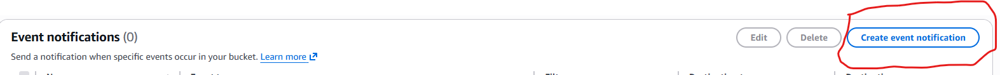

# Create-Lambda-function-to-automate-S3-file-processing.

## Full  Step-by-Step guide with snapshots to describe and illustrate how to create a Lambda function to automate S3 file processing.

### This project demonstrates how to create a Lambda function to automate S3 file processing.

* Create an S3 Bucket  

* Upload a test object to your bucket.

* Create an IAM policy & role that lets Lambda read from S3 and write logs to CloudWatch.

* Create and deploy a Lambda Function to be triggered when objects are uploaded to the S3 Bucket.

 

#### Step-by-Step Instructions on how to create a Lambda function to automate S3 file processing.
UPLOAD FILE TO S3 BUCKET
*Type & Select S3 from the AWS Search Bar.

  
    

  
* Select Create Bucket.
  
  
    

  
    

  
* Select the bucket that you just created.

  
    

  
* Select the Upload Button.

  
    

  
* Select the add files button and additionally select the file that you want to upload.

  
    

  
* Select Upload at the bottom.

  
    

  

CREATE IAM POLICY & ROLE TO ALLOW LAMBDA TO GET OBJECTS FROM AN S3 BUCKET AND TO WRITE TO AMAZON CLOUDWATCH

* Search and select IAM from the AWS search bar

  
    

  
* Select Policies from the left-hand options bar. 

  
    

  
* Select the Create Policy Button.

  
    

  
* Select the JSON Tab.

  
    

  
* Paste the below JSON Policy into the JSON Policy Editor.

  
    

  
*Select Next at the bottom of the page.

  
    

  
* Give your policy a name.

  
    

  
* Select Create Policy at the bottom of the page.

  
    

  
* Select Roles from the left-handed options bar

  
    

  
* Click Create Role

  
    

  
* Select AWS service as the trusted entity type.

  
    

  
* Select Lambda for the roles use case.

  
    

  
* Select Next at the bottom of the select trusted entity page.

  
    

  
* In the search box, type the policy that was created earlier and select it.

  
    

  
* Select Next at the bottom of the add permissions page.

  
    

  
* Give your Role a Name.

  
    

  
* Select the Create Role button at the bottom of the page.

  
    

  

CREATING A LAMBDA FUNCTION:

* Search and select Lambda from the AWS search bar

  
    

  

* Select Create Function

  
    

  
 

* Give your function a name.

  
    

  

* Select Python 3.13 from the runtime dialog box.

  
    

  

* Select X86_64 from architecture.

  
    

  

* Select Use an existing role from the Change default execution role section.

  
    

  

* Select the role you created earlier as the existing role.

  
    

  

* Select the Create Function button at the bottom.

  
    

  

* Select the Function recently created.

  
    

  

* In the code source, paste the below Python code into the Lambda Code Editor Box.

  
    

  

* Select Deploy from the Deploy Section.

  
    

  

CREATING AN AMAZON S3 TRIGGER EVENT NOTIFICATION USING LAMBDA
  
* Type & Select S3 from the Amazon Search Bar.

  
    

  

* Select the Bucket that was created earlier.

  
    

  

* Select the Properties Tab.
 
  
    

 * Scroll down to Event Notification and select Create Event Notification.

  
    

 * Select the checkbox that says all objects create events in the events type section.

  
    

 * Select the Lambda Function that was created earlier from the Lambda Function dropdown box.

  
    

 * Select Save Changes at the bottom of the page.

  
    

TEST THE LAMBDA FUNCTION USING A DUMMY EVENT

* Search and select Lambda from the AWS search bar

  
    

 * Select the earlier created Lambda Function.

  
    

* Select Test from the options.

  
    

* Scroll down and give your test a name in the Event Name box.

  
  
    

 * Paste the below Test Event JSON Policy into the Event JSON Policy Editor. Replace the following values:

   * Replace us-east-1 with the region where you are located.
   * Replace upload-trigger-bucket1 with the name of the S3 Bucket that you created.
   * Replace happyface.jpg with the name of the test object that you created.
  
      
  
     

  * Select the Save button when you scroll up.

   
  
    
  
  * Select the Test button that is directly to the right of Save.
  
  
    

TEST THE LAMBDA FUNCTION WITH THE AMAZON S3 TRIGGER

* Type & Select S3 from the AWS Search Bar.
  
  
    

* Select the Bucket that was created earlier.
  
  
    

* Select the Upload Button
  
  
    

* Select the add files button and additionally select the file that you want to upload.
  
  
    

*  Select Upload at the bottom.
  
  
    

VERIFY THE FUNCTION WAS TRIIGERED USING CLOUDWATCH LOGS

*  Search and select CloudWatch from the AWS search bar.

*  Select Log groups under logs on the left-hand side of the page.

*  Select the log group for your function by clicking on it

*  Select the most recent log stream.

* If the function was triggered correctly, the log stream will look something similar to below photo.
      

* Select the Lambda Function

  
    

 

##### Contribution Policy

This project is not accepting external contributions, including pull requests or feature requests.

It serves as a personal archive of my learning journey in applying foundational concepts in software development and version control. Active development is not ongoing, and external changes will not be integrated.

Thank you for your understanding.
